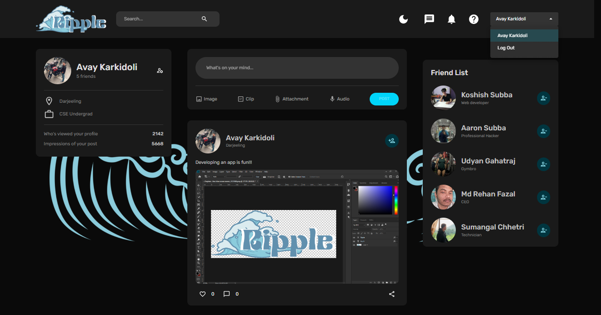

  

<h1>Ripple - Social Media Application</h1>
Welcome to Ripple, a social media application that allows users to share posts, interact with other users, and personalize their experience with dark and light modes. 
Ripple offers full user authentication, including login, logout, signup, and password management features. 
Users can create posts, view other users' posts, interact and can also follow/unfollow other users.

  

<h2>💻 Tech Stack</h2>
<ul style="list-style-type:circle">
  <li><h3>Frontend</h3>
      <ul style="list-style-type:disc">
        <li>React (for creating user interface)</li>
        <li>React Router (for navigation)</li>
        <li>formik + yup (for form validation)</li>
        <li>Redux Toolkit (for state management)</li>
        <li>Redux Persist (for local storage)</li>
        <li>React Dropzone (for image uploads)</li>
      </ul>
  </li>
  <li><h3>Backend</h3>
      <ul style="list-style-type:disc">
        <li>Node.js (as runtime)</li>
        <li>Express.js (backend framework)</li>
        <li>Mongoose (for managing mongo database)</li>
        <li>JWT (JSON Web Tokens) (for authentication)</li>
        <li>Multer (for file upload)</li>
        <li>MongoDB Atlas (for cloud database storage)</li>
      </ul>
  </li>
  </ul>
  <h2>⭐ Features</h2>
  <ul style="list-style-type:circle">
  <li><h3>User Authentication:</h3>
      <ul style="list-style-type:disc">
        <li>Signup with username, email and password</li>
        <li>Login with username or email and password</li>
        <li>formik + yup (for form validation)</li>
        <li>Logout</li>
      </ul>
  </li>
  <li><h3>Post interactions:</h3>
      <ul style="list-style-type:disc">
        <li>Create new posts</li>
        <li>Upload Photos</li>
        <li>Like posts</li>
        <li>Follow/unfollow other users</li>
        <li>View post likes and comments</li>
      </ul>
  </li>
    <li><h3>Accessibility:</h3>
      <ul style="list-style-type:disc">
        <li>Dark mode</li>
        <li>Light mode</li>
        <li>Mobile-friendly layout</li>
        <li>Responsive layout</li>
      </ul>
  </li>
  </ul>
  

  

  

  <h3>Thank you for reading ❤️</h3>

